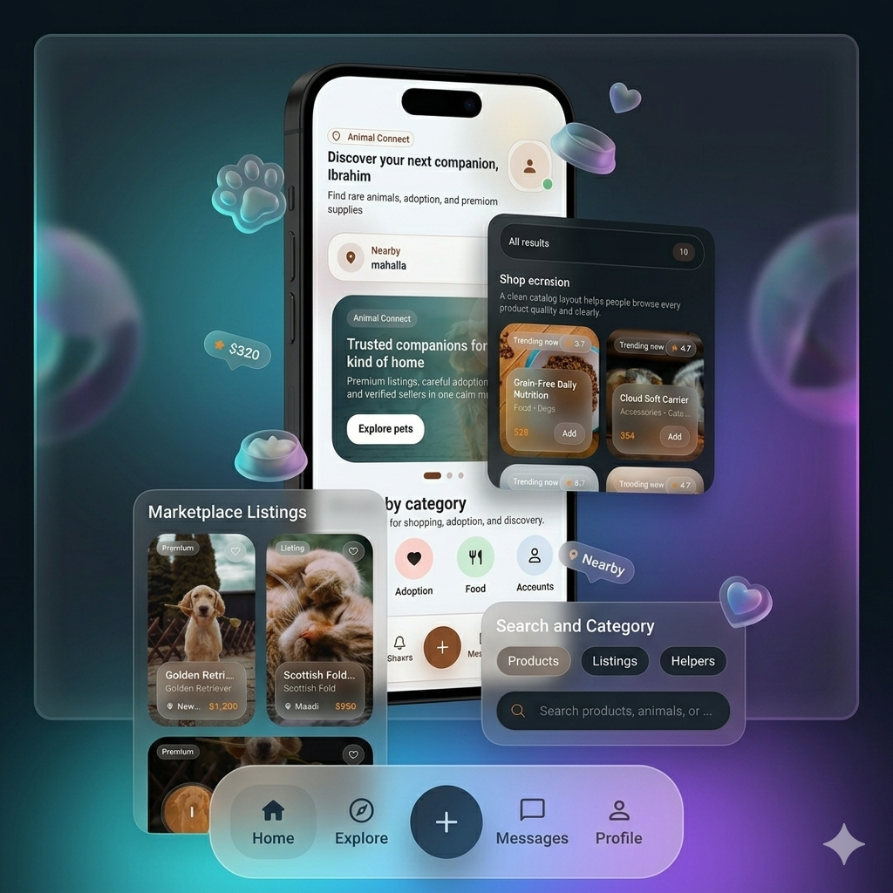
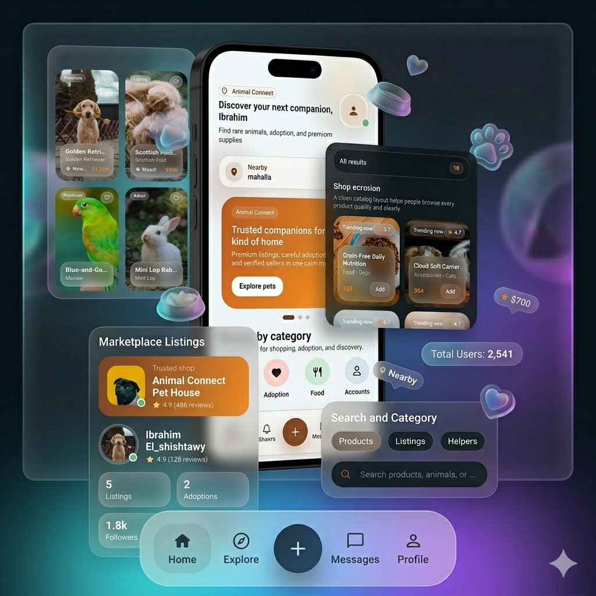

# Animal smartttherect

  
  

  A modern mobile platform for discovering rare animals, adoption opportunities, and premium pet supplies in one seamless experience.

---

## Overview

Animal Zone is a smart and modern application built to create a complete digital experience for animal lovers, breeders, and adoption seekers.  
The app brings together animal discovery, adoption, shopping, nearby search, and user interaction in a clean and user-friendly environment.

Instead of separating these needs across multiple services, Animal Connect puts everything in one place with a smooth mobile experience and a polished design.

---

## What Makes Animal Zone Animall

Animal Zone is more than just a marketplace.  
It is desigthanmplete ecosystem that helps users:

- Explore rare animals in a simple and attractive way
- Find animals available for adoption
- Shop for food and pet supplies
- Discover nearby listings using location-based features
- Communicate through an in-app chat experience
- Enjoy a modern interface with dark and light mode support

The goal is to make the journey easier, faster, and more professional for every user.

---

## Core Features

### Rare Animal Marketplace
A dedicated experience for browsing and exploring rare animals with detailed presentation and organized listings.

### Adoption Experience
A smooth adoption flow that helps users discover animals needing a home with clear details and an easy-to-follow interface.

### Pet Supplies Store
A shopping experience for food, accessories, and essential supplies, designed with filtering and search to improve usability.

### Nearby Discovery
Location-based exploration that helps users find animals and opportunities close to them.

### Messaging System
A direct communication channel between users to make conversations around buying, selling, and adoption more convenient.

### Premium Interface
A clean and modern design language focused on clarity, comfort, and a better user journey across all screens.

### Theme Support
Carefully designed dark mode and light mode to match different user preferences and improve accessibility.

---

## User Experience Focus

Animal Connect is designed with strong attention to:

- clean layouts
- balanced spacing
- smooth navigation
- modern card-based sections
- attractive visual hierarchy
- simplified browsing and interaction

The experience is built to feel professional, clear, and comfortable from the first screen to the last.

---

## Product Vision

The vision behind Animal Connect is to build a trusted and scalable digital platform for the animal community.

It aims to connect people with:
- better adoption opportunities
- easier access to rare animals
- more convenient shopping for supplies
- a more organized and premium mobile experience

The product is designed to grow into a complete solution that serves both individual users and professional sellers.

---

## Technology Behind the Project

Animal Connect was developed as a full product experience covering mobile development, backend services, and database design.

### Mobile Development
- Flutter

### State Management
- BLoC

### Backend Development
- Node.js

### Database
- MongoDB

This combination allows the application to be flexible, scalable, and ready for future expansion.

---

## Highlights

- Modern mobile experience
- Marketplace and adoption in one platform
- Supplies store integration
- Location-based discovery
- Chat and communication flow
- Dark and light mode support
- Clean and scalable architecture
- Strong focus on usability and presentation

---

## Project Direction

Animal Connect is built with a product mindset, not just as a technical demo.  
It focuses on solving real user needs while maintaining a polished look and a strong technical foundation.

The direction of the project is centered around:
- usability
- growth
- reliability
- clean design
- scalable development

---

## Preview

  
  

---

## Final Note

Animal Connect represents a complete mobile product idea that combines utility, design, and real-world value.  
It is built to deliver a modern experience for users who want to explore, adopt, shop, and connect in one place.
